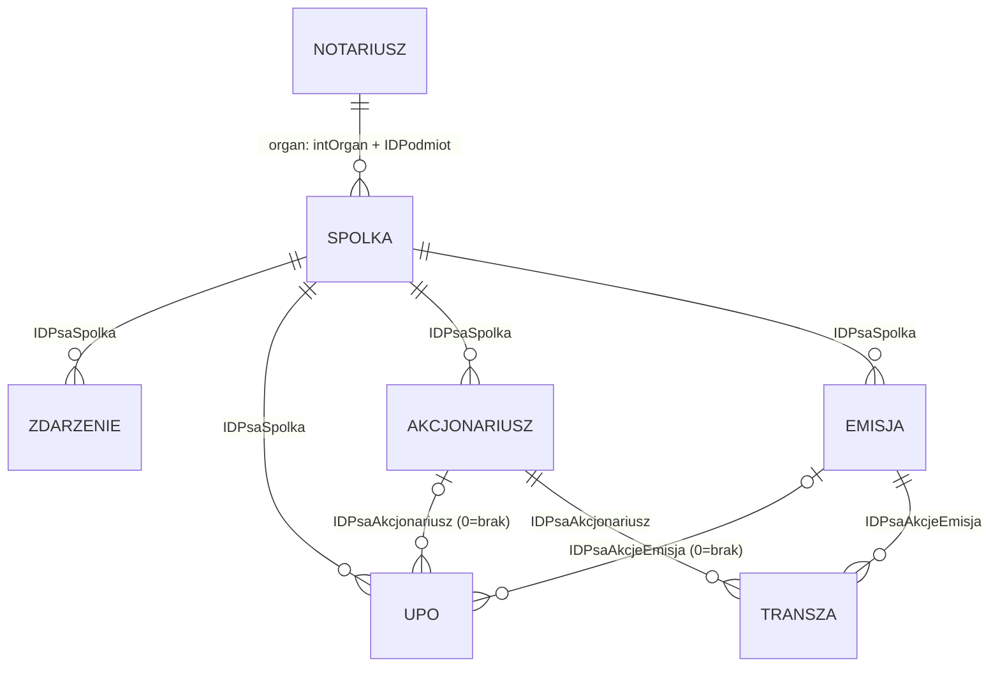

# Inwentaryzacja: Rejestr Prostych Spółek Akcyjnych (rejestry-notarialne.pl)

**Cel:** kompletny opis okien, rejestrów, pól i przepływu informacji obecnego Rejestru PSA (KRN / RejNET) jako specyfikacja wyjściowa dla nowej wersji rejestru w kancelarii.
**Data inwentaryzacji:** 2026-09-26 · **Konto:** notariusz Łukasz Kozon (Rep. N: RU58-07336)
**Metoda:** wyłącznie odczyt. Otwierano listy, formularze i okna wyboru; każdy formularz zamykano klawiszem *Anuluj*. Nie użyto żadnego klawisza zapisu (*OK* w formularzach, *Transakcja → OK*, *Objęcie akcji → OK*, *Drukuj*). Filtry (*Fraza*, *Stan na*) zmieniano tylko po stronie przeglądarki — nie zmieniają danych.
**Stan danych w kancelarii:** 3 spółki (ID 2068 Charlie Unicorn AI PSA, ID 1031 Hermes Data & Software Solutions PSA, ID 1351 Yama Group PSA).

Oznaczenia w tabelach pól:
- **Tryb:** `ro` – tylko odczyt, `rw` – edytowalne, `hro` – ukryte tylko odczyt (klucz techniczny), `HID` – pole ukryte.
- **Wym.:** ✔ – wymagane (brak znacznika „opcjonalne” w UI), ○ – opcjonalne (`clsOpcjonalne`).
- **Format:** nazwa walidatora frameworka (np. `kodPocztowy`, `PESEL`, `kwota`, `emailN`). Sufiks `N` prawdopodobnie oznacza dopuszczalną wartość pustą – do weryfikacji w nowej wersji.
- **Id techniczne:** końcówka identyfikatora pola (`plgRejestryNot-<moduł>-formularz1-<id>`) – de facto nazwa kolumny w modelu danych.

---

## 1. Architektura i nawigacja

### 1.1 Położenie w serwisie
Menu lewe → **REJESTRY** → **Proste spółki akcyjne** (`/210`, opis) → **Rejestr PSA** (`/211`, właściwy rejestr).
Inne pozycje menu REJESTRY (poza zakresem): Rejestr Spadkowy PL, Rejestr Spadkowy EPS, Rejestr Testamentów, Repozytorium Wypisów, Zarządca sukcesyjny, Rejestr Weryfikacji Zastrzeżeń Numerów PESEL.

Nagłówek każdej strony: licznik sesji (30:00, odliczanie), „Użytkownik: [notariusz]”, dane kancelarii (nazwisko i imię, nazwa kancelarii, adres, NIP, tel., e-mail), **Rep. N** z klawiszem *Kopiuj* (do schowka), *Wyloguj*. Dostęp: kwalifikowany podpis elektroniczny notariusza lub zastępcy (wg opisu na `/210`).

### 1.2 Opis systemu ze strony `/210` (streszczenie)
1. Notariusz podpisuje ze spółką umowę o prowadzenie rejestru.
2. Rejestruje spółkę (dane identyfikacyjne i teleadresowe).
3. W **Rejestrze Przywilejów i Obowiązków** rejestruje uprzywilejowania i obowiązki spółki, akcjonariuszy, serii/transz (głos, dywidenda, podział majątku, udział akcji założycielskich, uprawnienia indywidualne).
4. W **Rejestrze Emisji Akcji** rejestruje emisje (seria/transza, numery) z aktu założycielskiego lub uchwał WZA.
5. W **Rejestrze Akcjonariuszy** rejestruje akcjonariuszy.
6. W **Rejestrze Akcji** odnotowuje przepływ akcji: spółka ↔ akcjonariusz (objęcie, wykup w celu umorzenia) i akcjonariusz ↔ akcjonariusz (zbycie/nabycie, dziedziczenie, darowizna).
7. W **Rejestrze Zdarzeń** – zdarzenia nieujęte w innych rejestrach (zmiany umowy spółki, decyzje WZA o emisji itp.).
8. Prowadzenie rejestru można przekazać innemu notariuszowi (wskazanie w danych spółki) albo – przy zaprzestaniu działalności kancelarii – radzie izby notarialnej (prezes/wiceprezes rady).

### 1.3 Technologia (istotne dla migracji/odtworzenia)
- Framework **RUI2** (RejNET) + jQuery 3.7.1; strona serwerowa, operacje przez AJAX: `$libRui2Funkcje.libAjax.aafWyslij('appRejestryNot_psa_cms.<moduł>.<komponent>.<komenda>', <base64 JSON parametrów>)`.
- Kontrolki jako custom elements: `rui2-input`, `rui2-select`, `rui2-data`, `rui2-checkbox`, `rui2-stronicowanie`; wartość w atrybucie `wartosc` (base64), tryb w `tryb` (`ro`/`rw`/`hro`), walidator w `format`/`typ`.
- Okna = **modalne dialogi nakładane na stos** (`ctrDialogbox1_1`, `_2`, `_3` …). Zamknięcie okna wraca do poprzedniego poziomu.
- Moduły backendu (nazwy techniczne):

| Moduł | Znaczenie |
|---|---|
| `rejPsaSpolki` | Rejestr PSA (lista spółek, formularz spółki, raport) |
| `rejPsaZdarzenia` | Rejestr zdarzeń |
| `rejPsaUprawnieniaObowiazki` | Rejestr uprawnień, przywilejów i obowiązków |
| `rejPsaAkcjonariusze` | Rejestr akcjonariuszy (także okno wyboru akcjonariusza) |
| `rejPsaAkcjeEmisje` | Rejestr emisji akcji (+ objęcie akcji) |
| `rejPsaAkcje` | Rejestr akcji (transze, transakcje, umorzenia) |
| `rejUzytkownicy` | Słownik notariuszy (okno wyboru organu prowadzącego) |
| — | Rejestr zajęć, zastawów, użytkowania – **niezaimplementowany** |

---

## 2. Mapa okien (drzewo nawigacji)

```
/211 REJESTR PROSTYCH SPÓŁEK AKCYJNYCH (lista spółek)
├── [Dodaj]  → PSA: nowy wpis (formularz spółki)
├── [Pokaż]  → PSA: edycja wpisu (formularz spółki)
│             └── [Wybierz] (organ) → NOTARIUSZE (okno wyboru, 4351 notariuszy)
├── [Rejestr Akcjonariuszy PSA] → Komunikat (zmiana widoczna od dnia następnego) → [Dalej]
│             └── REJESTR AKCJONARIUSZY PROSTEJ SPÓŁKI AKCYJNEJ (podgląd wydruku) → [Drukuj]
└── Rejestry + [Wybierz]:
    ├── 1 Rejestr zdarzeń ───────────────── [Dodaj]/[Pokaż] → formularz zdarzenia
    ├── 2 Rejestr uprawnień, przywilejów i obowiązków (kontekst: spółka)
    │                                        [Dodaj]/[Pokaż] → formularz U/P/O
    ├── 3 Rejestr akcjonariuszy ─────────── [Dodaj]/[Pokaż] → formularz akcjonariusza
    │   └── Rejestry + [Wybierz]:
    │       ├── 1 Rejestr praw, przywilejów i obowiązków (kontekst: akcjonariusz)
    │       └── 2 Rejestr akcji (filtr: akcjonariusz) → [Transakcja]
    ├── 4 Rejestr emisji akcji ──────────── [Dodaj]/[Pokaż] → formularz emisji
    │   ├── [Objęcie akcji] → formularz objęcia → [Wybierz] → okno wyboru akcjonariusza
    │   └── Rejestry + [Wybierz]:
    │       ├── 1 Rejestr praw, przywilejów i obowiązków (kontekst: emisja)
    │       └── 2 Rejestr akcji (filtr: emisja) → [Transakcja]
    ├── 5 Rejestr akcji (cała spółka) ───── [Transakcja] → formularz transakcji
    │                                        └── [Wybierz] → okno wyboru akcjonariusza (z [Dodaj]/[Pokaż])
    └── 6 Rejestr zajęć, zastawów, użytkowania → Komunikat „Rejestr w przygotowaniu”
```

---

## 3. Wzorce wspólne

### 3.1 Wzorzec okna rejestru (lista)
- **Tytuł:** `<FIRMA SPÓŁKI | NAZWISKO AKCJONARIUSZA | TYTUŁ EMISJI>: REJESTR …` – tytuł wskazuje kontekst (rodzica).
- **Pasek narzędzi:** *Zamknij* (zamyka okno), *Pokaż* („Podgląd, sprostowanie, zmiana statusu wpisu (w tym oznaczenie wpisu jako wykreślonego)”), *Dodaj* („Dodanie nowego wpisu”), klawisze specjalne rejestru (*Objęcie akcji*, *Transakcja*), pole **Rejestry** + *Wybierz* („Wybór rejestru zależnego”), pole **Fraza** + *Filtr*, w rejestrach akcji dodatkowo **Stan na**.
- **INFORMACJE OGÓLNE** (sekcja zwijana) i **PYTANIA I ODPOWIEDZI** (pytania rozwijane kliknięciem).
- **Stronicowanie:** « ‹ [nr strony] › » (10 wierszy na stronę).
- **Tabela:** kolumna ID, kolumny merytoryczne, **Info** (ikony *OP* – opis drukowany na raporcie, *UN* – uwagi notariusza), **S** (ikona statusu). Zaznaczenie wiersza: kliknięcie (podświetlenie). Operacje *Pokaż*, *Wybierz*, *Transakcja*, *Objęcie akcji* działają na zaznaczonym wierszu.
- **Legenda** pod tabelą + licznik **RAZEM: n**. Pusta tabela: „Brak danych...”.
- Brak fizycznego usuwania – „usunięcie” = zmiana statusu na *wykreślony* (soft delete) przez *Pokaż*.

### 3.2 Wzorzec formularza wpisu
- Tytuł: `<KONTEKST>: nowy …` / `<KONTEKST>: edycja …`; klawisze **OK** (zapis, `formularz1.cmdZapisz` lub komenda operacji) i **Anuluj**.
- Pasek informacji: **„Operacja: bezpłatna”** (platforma przewiduje operacje płatne – por. menu ROZLICZENIA/Cennik).
- Sekcje stałe (identyczne w każdym formularzu):

| Sekcja | Pole | Id techniczne | Typ/format | Tryb |
|---|---|---|---|---|
| REJESTRACJA | ID (ID wpisu; 0 dla nowego) | `ID` | integer | ro |
| | Data (data rejestracji wpisu) | `dtDataR` | data+czas HH:MM:SS | ro (nadawana przy zapisie) |
| NOTARIUSZ | Nazwisko / Imię / Rep. N | `strNotariuszNazwisko`, `strNotariuszImie`, `strNotariuszRepN` | tekst | ro (z sesji) |
| ZASTĘPCA NOTARIUSZA | Nazwisko / Imię / Rep. N | `strNotariuszZastepcaNazwisko`, `…Imie`, `…RepN` | tekst | ro (z sesji, gdy działa zastępca) |
| (ukryte) | ID spółki (+ kontekst) | `IDPsaSpolka` (+ `IDPsaAkcjonariusz`, `IDPsaAkcjeEmisja`) | integer | ro/HID |
| (merytoryczna) | … | … | … | … |
| (na końcu) | Status | `intStatus` | select | rw |
| | Komentarz do statusu | `strStatus` | textarea | rw ○ |
| INFORMACJE DODATKOWE | Opis (drukowany na raporcie spółki) | `strOpis` | textarea | rw ○ |
| | Uwagi notariusza (do użytku wewnętrznego) | `strUwagi` | textarea | rw ○ |

- Każde pole ma etykietę i dymek (tooltip) z opisem; walidacja na bieżąco (ramka zielona = poprawne).
- Pola daty mają ikonę kalendarza.

---

## 4. Okna i pola – pozycja po pozycji

### 4.1 Lista spółek – REJESTR PROSTYCH SPÓŁEK AKCYJNYCH (`/211`)

**INFORMACJE OGÓLNE:** rejestr zawiera wykaz PSA, dla których prowadzony jest Rejestr Akcjonariuszy PSA (art. 300³⁰ KSH); system oparty na współpracujących rejestrach zależnych; każdy rejestr/formularz ma informacje ogólne, Q&A i legendę.

**PYTANIA I ODPOWIEDZI:**
1. *Jak rozpocząć pracę z rejestrami?* – *Dodaj* → uzupełnić wymagane pola → *OK*; zaznaczyć wpis; wybrać rejestr zależny (pole *Rejestry*) → *Wybierz*; dalej w nowym oknie.
2. *Jak sprostować dane spółki lub przekazać prowadzenie spółki (innemu notariuszowi / izbie)?* – zaznaczyć wpis → *Pokaż* → dalej w nowym oknie.
3. *Kiedy uwidaczniana jest zmiana akcjonariatu na wydruku?* – w aplikacji natychmiast; **na wydruku w dniu następnym** po dacie rejestracji zmiany.
4. *Jak wydrukować Rejestr Akcjonariuszy PSA?* – zaznaczyć wpis → *Rejestr Akcjonariuszy PSA* → *Drukuj*.

**Pasek narzędzi:**

| Element | Id | Działanie |
|---|---|---|
| Pokaż | `rejestr1.cmdPokaz` | formularz spółki (edycja) dla zaznaczonego wiersza |
| Dodaj | `rejestr1.cmdDodaj` | formularz spółki (nowy wpis) |
| Rejestry (select) | `intOperacjaRejestrowa` | 1 Rejestr zdarzeń · 2 Rejestr uprawnień, przywilejów i obowiązków · 3 Rejestr akcjonariuszy · 4 Rejestr emisji akcji · 5 Rejestr akcji · 6 Rejestr zajęć, zastawów, użytkowania |
| Wybierz | `rejestr1.cmdOperacjaWybierz` | otwiera wybrany rejestr zależny dla zaznaczonej spółki |
| Fraza + Filtr | `strFraza`, `cmdFiltr` | przeszukuje: firmę, NIP, REGON, nr KRS (sprawdzone) oraz najpewniej e-mail (fraza „GRABSKI” trafiła na spółkę z e-mailem …@grabski.pl). **Nie** przeszukuje miejscowości ani nazwisk akcjonariuszy |
| Stan na (data) | `dtStanNa` | „Stan akcjonariatu (na wskazany dzień) dla wydruku Rejestru Akcjonariuszy PSA”; domyślnie dziś |
| Rejestr Akcjonariuszy PSA | `rejestr1.cmdRaport1` | raport/wydruk (pkt 4.9) |

**Kolumny tabeli:**

| Kolumna | Zawartość |
|---|---|
| ID | ID wpisu spółki |
| (daty) | **DU** – data utworzenia spółki; **DR** – data i godzina rejestracji wpisu |
| Spółka | firma (wyróżniona), miejscowość, kraj; NIP, REGON, „KRS [nazwa sądu rejestrowego]: nr”; tel., e-mail, www; komentarz do statusu (czerwona drobna czcionka) |
| Organ prowadzący rejestr | np. „NOTARIUSZ KOZON ŁUKASZ, GDAŃSK” |
| Info | OP / UN |
| S | status: wykreślony, w przygotowaniu, zawieszony, w likwidacji, aktywny |

Sortowanie zaobserwowane: alfabetycznie wg firmy.

### 4.2 Formularz spółki – „PROSTA SPÓŁKA AKCYJNA: nowy wpis / edycja wpisu”

**INFORMACJE OGÓLNE:** nową spółkę może zarejestrować notariusz lub wskazany przez niego zastępca (zastępca notarialny, inny notariusz, notariusz emerytowany); rejestrujący (lub mocodawca zastępstwa) jest automatycznie **organem prowadzącym rejestr**; prowadzenie można przekazać innemu notariuszowi lub właściwej izbie.

**Q&A:**
- *Jak przekazać prowadzenie innemu notariuszowi?* – Typ = NOTARIUSZ → *Wybierz* → wyszukać notariusza, zaznaczyć, *OK* → dane w polu Nazwa → *OK*. **Zakończenie operacji blokuje dotychczasowy dostęp do danych spółki.**
- *Jak przekazać prowadzenie izbie notarialnej?* – Typ = IZBA NOTARIALNA …, reszta bez zmian → *OK*. Blokada dostępu jak wyżej.

Sekcje stałe wg 3.2 (REJESTRACJA, NOTARIUSZ, ZASTĘPCA NOTARIUSZA), dalej:

**ORGAN PROWADZĄCY REJESTR**

| Pole | Id | Typ | Tryb | Wartości / uwagi |
|---|---|---|---|---|
| Typ | `intOrgan` | select | ro przy nowym wpisie, rw w edycji | 1 IN w Białymstoku, 2 Gdańsku, 3 Katowicach, 4 Krakowie, 5 Lublinie, 6 Łodzi, 7 Poznaniu, 8 Rzeszowie, 9 Szczecinie, 10 Warszawie, 11 we Wrocławiu, **1001 NOTARIUSZ** (domyślnie) |
| *Wybierz* | `cmdOkno` → callback `cmdUzytkownikNotariusz` | klawisz | – | okno NOTARIUSZE (4.2.1) |
| ID | `IDPodmiot` | tekst | ro, HID | ID użytkownika-notariusza (np. 7336) |
| Rep. N | `strPodmiotRepN` | tekst | ro | |
| Nazwa | `strPodmiotNazwa` | tekst | ro | „NAZWISKO IMIĘ, SIEDZIBA” |

**SPÓŁKA**

| Pole (tooltip) | Id | Format | Tryb | Wym. | Uwagi |
|---|---|---|---|---|---|
| Data utworzenia (spółki) | `dtDataU` | typData | rw | ✔ | domyślnie dziś |
| Nazwa (spółki) | `strNazwa` | tekst | rw | ✔ | |
| Kraj | `strKraj` | select | ro | ✔ | PL (zablokowane); lista: PL, IT, BE, FR, DE, AT |
| Kod pocztowy | `strKod` | kodPocztowy | rw | ✔ | |
| Miejscowość | `strMiejscowosc` | miejscowosc | rw | ✔ | |
| Ulica | `strUlica` | tekst | rw | ✔ | |
| Numer budynku | `strDomNr` | domNr | rw | ✔ | |
| Numer lokalu | `strLokalNr` | lokalNr | rw | ○ | |
| Numer NIP | `strNip` | tekst | rw | ✔ | |
| Numer REGON | `strRegon` | tekst | rw | ✔ | |
| Nazwa sądu rejestrowego („np. KRS [Rejestr Przedsiębiorców], RFR, …”) | `strSadRejestrowyWpisNazwa` | tekst | rw | ✔ | domyślnie „KRS [Rejestr Przedsiębiorców]” |
| Wydział rejestru sądowego („np. VIII Wydział Gospodarczy Katowice”) | `strSadRejestrowyWpisWydzial` | tekst | rw | ✔ | tekst swobodny (w praktyce pełna nazwa sądu i wydziału) |
| Nr wpisu w rejestrze sądowym („np. KRS”) | `strSadRejestrowyWpisNr` | tekst | rw | ✔ | |
| Numer telefonu | `strTelefon` | telefonN | rw | ✔? | |
| Adres e-mail | `strEmail` | emailN | rw | ✔? | |
| Adres www | `strWww` | wwwN | rw | ○ | |
| Status | `intStatus` | select | rw | ✔ | 1 SPÓŁKA W PRZYGOTOWANIU, 2 ZAWIESZONA, 3 W LIKWIDACJI, 4 AKTYWNA, −1 WYKREŚLONA |
| Komentarz do statusu | `strStatus` | textarea | rw | ○ | |

**INFORMACJE DODATKOWE:** Opis (drukowany na raporcie), Uwagi notariusza (wewnętrzne) – oba ○. W praktyce kancelarii *Uwagi notariusza* przechowują m.in. ograniczenia rozporządzania akcjami z umowy spółki (np. prawo pierwszeństwa).

#### 4.2.1 Okno wyboru – NOTARIUSZE (`rejUzytkownicy`)
- Info: „Rejestr zawiera listę aktywnych notariuszy w Polsce”; wybór wiersza + *OK*; *Fraza* (nazwisko) + *Filtr* lub Enter.
- Kolumny: ID · Funkcja (NOTARIUSZ) · Nazwisko i imię, siedziba kancelarii · Izba notarialna. Wolumen: 4351 pozycji (436 stron).
- *OK* → uzupełnia sekcję ORGAN PROWADZĄCY REJESTR w formularzu spółki.

### 4.3 Rejestr zdarzeń (`rejPsaZdarzenia`)
- Info: „Rejestr przechowuje historię zdarzeń spółki, których nie można odnotować w innych rejestrach zależnych (np. walne zgromadzenie akcjonariuszy)”.
- Pasek: Zamknij, Pokaż, Dodaj, Fraza, Filtr. Kolumny: ID · **DZ** (data zdarzenia) / **DR** · Zdarzenie · Info · S. Legenda statusu: wykreślony, w przygotowaniu, aktywny + ikony **priorytetu** (wysoki, średni, niski).
- Stan danych: 0 wpisów we wszystkich spółkach.

**Formularz „<SPÓŁKA>: nowe zdarzenie / edycja”** – sekcje stałe + **ZDARZENIE**:

| Pole (tooltip) | Id | Format | Tryb | Wym. | Wartości |
|---|---|---|---|---|---|
| Typ (typ zdarzenia) | `intTyp` | select | rw | ✔ | 1 ZDARZENIE ZWYKŁE (jedyna wartość) |
| Data (data zdarzenia) | `dtDataZ` | typData | rw | ✔ | |
| Priorytet | `intPriorytet` | select | rw | ✔ | 1 WYSOKI, 2 ŚREDNI, 3 NISKI (domyślnie) |
| Temat (temat zdarzenia) | `strTemat` | tekst | rw | ✔ | |
| Status | `intStatus` | select | rw | ✔ | 1 W PRZYGOTOWANIU, 2 AKTYWNY (domyślnie), −1 WYKREŚLONY |
| Komentarz do statusu / Opis / Uwagi | `strStatus`, `strOpis`, `strUwagi` | textarea | rw | ○ | |

### 4.4 Rejestr uprawnień, przywilejów i obowiązków (`rejPsaUprawnieniaObowiazki`)
- Info: „Rejestr przechowuje historię uprawnień, przywilejów i obowiązków (spółki, akcjonariuszy, emisji akcji)”.
- **Trzy konteksty wywołania** (ten sam rejestr, inne klucze): ze spółki (`IDPsaAkcjonariusz = 0`, `IDPsaAkcjeEmisja = 0`), z akcjonariusza (ustawiony `IDPsaAkcjonariusz`), z emisji (ustawiony `IDPsaAkcjeEmisja`). Tytuł okna = nazwa kontekstu.
- Pasek: Zamknij, Pokaż, Dodaj, Fraza, Filtr. Kolumny: ID · **DU** (data ustanowienia) / **DR** · Tytuł (+ treść komentarza pod tytułem) · Info · **U** · **P** · **O** (ikony: uprawnienie/przywilej/obowiązek) · S (wykreślony, w przygotowaniu, aktywny).
- Stan danych: Hermes – 1 wpis („Akcje założycielskie”, U); Yama – 2 wpisy („AKCJE ZAŁOŻYCIELSKIE” U; „AKCJE NIEMIE” [sic] U+O); wszystkie założone w kontekście spółki (nie emisji), mimo że dotyczą serii.

**Formularz „<KONTEKST>: nowe / edycja uprawnień, przywilejów i obowiązków”** – sekcje stałe + **UPRAWNIENIE, PRZYWILEJ, OBOWIĄZEK**:

| Pole | Id | Format | Tryb | Wym. | Wartości |
|---|---|---|---|---|---|
| (ukryte) ID spółki / akcjonariusza / emisji | `IDPsaSpolka`, `IDPsaAkcjonariusz`, `IDPsaAkcjeEmisja` | integer | ro HID | – | z kontekstu; 0 = brak powiązania |
| Rodzaj – 3 checkboxy | `intTyp` | **maska bitowa** | rw | ✔ | 1 PRZYWILEJ, 2 UPRAWNIENIE, 4 OBOWIĄZEK (np. 6 = U+O) |
| Data (ustanowienia) | `dtDataU` | typData | rw | ✔ | |
| Temat (ustanowienia) | `strTemat` | tekst | rw | ✔ | |
| Status | `intStatus` | select | rw | ✔ | 1 W PRZYGOTOWANIU, 2 AKTYWNY (domyślnie), −1 WYKREŚLONY |
| Komentarz do statusu / Opis / Uwagi | | textarea | rw | ○ | |

Uwaga praktyczna: brak dedykowanego pola „treść uprawnienia” – w danych kancelarii treść postanowienia wpisano w *Komentarz do statusu*, który **nie jest drukowany** na raporcie (drukuje się tytuł, litery U/P/O i ewentualnie *Opis*).

### 4.5 Rejestr akcjonariuszy (`rejPsaAkcjonariusze`)
- Info: „Rejestr przechowuje informacje o bieżących oraz byłych akcjonariuszach spółki”. W trybie **okna wyboru** dodatkowo: „Aby kontynuować operację wybierz akcjonariusza z listy i potwierdź wybór klawiszem OK” oraz widoczne *OK*/*Anuluj* (`strWyszukiwarkaOk`).
- Pasek: Zamknij, Pokaż, Dodaj, **Rejestry** (1 Rejestr praw, przywilejów i obowiązków · 2 Rejestr akcji) + Wybierz, Fraza, Filtr.
- Kolumny: ID · DR · Akcjonariusz: typ (OSOBA FIZYCZNA/PRAWNA), NAZWISKO IMIONA / FIRMA, miejscowość, kraj; PESEL/NIP, tel., e-mail · Info · S (wykreślony, w przygotowaniu, aktywny). **Brak liczby posiadanych akcji na liście.**

**Formularz „<SPÓŁKA>: nowy / edycja akcjonariusza”** – sekcje stałe + **AKCJONARIUSZ**:

| Pole (tooltip) | Id | Format | Tryb | Wym. | Uwagi |
|---|---|---|---|---|---|
| Typ (typ akcjonariusza) | `intTyp` | select | rw | ✔ | 1 OSOBA PRAWNA, 2 OSOBA FIZYCZNA – przełącza dostępność pól (niżej) |
| Nazwa (osoba prawna) | `strNazwa` | tekst | rw tylko dla typu 1 | ✔ (typ 1) | |
| Nazwisko (osoba fizyczna) | `strNazwisko` | tekst | rw tylko dla typu 2 | ✔ (typ 2) | |
| Imię (osoba fizyczna) | `strImie` | tekst | rw tylko dla typu 2 | ✔ (typ 2) | wszystkie imiona w jednym polu |
| Typ adresu | `intAdresTyp` | select | rw | ✔ | 1 ADRES PODMIOTU, 2 ADRES DO DORĘCZEŃ – **tylko jeden adres na akcjonariusza** |
| Kraj | `strKraj` | select | rw | ✔ | pełny słownik ISO-3166 (~245 pozycji, w tym XX = NIEZNANY) |
| Kod pocztowy | `strKod` | tekst | rw | ✔ | |
| Miejscowość | `strMiejscowosc` | miejscowosc | rw | ✔ | |
| Ulica | `strUlica` | tekst | rw | ✔ | |
| Nr domu | `strDomNr` | domNr | rw | ✔ | |
| Nr lokalu | `strLokalNr` | lokalNr | rw | ○ | |
| Nr PESEL | `strPesel` | PESEL (walidacja sumy) | rw tylko typ 2 | ○ | |
| Nr NIP | `strNip` | tekst | rw | ○ | |
| Nr REGON | `strRegon` | tekst | rw tylko typ 1 | ○ | |
| Sąd i oddział KRS | `strSadRejestrowyWpisNazwa` | tekst | rw tylko typ 1 | ○ | |
| Nr KRS | `strSadRejestrowyWpisNr` | tekst | rw tylko typ 1 | ○ | |
| Nr telefonu / Adres e-mail / Adres www | `strTelefon`, `strEmail`, `strWww` | telefonN, emailN, wwwN | rw | ○ | e-mail drukuje się na raporcie w nawiasie [ ] |
| Status | `intStatus` | select | rw | ✔ | 1 W PRZYGOTOWANIU, 2 AKTYWNY, −1 WYKREŚLONY |
| Komentarz / Opis / Uwagi | | textarea | rw | ○ | |

Logika przełącznika *Typ* (skrypt klienta): typ 2 → blokuje i czyści Nazwa, REGON, Sąd, Nr KRS; odblokowuje Nazwisko, Imię, PESEL, NIP. Typ 1 → blokuje i czyści Nazwisko, Imię, PESEL; odblokowuje Nazwa, NIP, REGON, Sąd, Nr KRS.

### 4.6 Rejestr emisji akcji (`rejPsaAkcjeEmisje`)
- Info: „Rejestr przechowuje pełną historię emisji akcji spółki. Akcje nowej emisji muszą być objęte przez akcjonariuszy przed dalszymi operacjami (np. transakcją zbycia i nabycia akcji).”
- **Q&A:** (1) *Jak przypisać akcje emisji do akcjonariusza?* – zaznaczyć emisję → *Objęcie akcji* → uzupełnić → *OK*. (2) *Jak sprawdzić, kto posiada akcje emisji?* – zaznaczyć → Rejestry → Rejestr akcji → *Wybierz*. (3) *Jak sprawdzić prawa, przywileje i obowiązki emisji?* – zaznaczyć → Rejestry → Rejestr praw, przywilejów i obowiązków → *Wybierz*.
- Pasek: Zamknij, Pokaż, Dodaj, **Objęcie akcji** (`cmdObjecieAkcji`), Rejestry (1 Rejestr praw, przywilejów i obowiązków · 2 Rejestr akcji) + Wybierz, Fraza, Filtr.
- Kolumny: ID · **DE** (data emisji) / **DR** · Emisja: tytuł; „Seria: X; Nr początkowy: n; Ilość: n; Cena emisyjna: x WAL”; podstawa prawna · Info · S (wykreślony, w przygotowaniu, **w umarzaniu**, **umorzony**, aktywny).
- **Reguła:** *Pokaż* na emisji, z której objęto akcje → komunikat „**Akcje zostały już objęte - sprostowanie emisji nie jest możliwe.**” (formularz otwiera się, zapis zablokowany).

**Formularz „<SPÓŁKA>: nowa / edycja emisji akcji”** – sekcje stałe + **EMISJA AKCJI**:

| Pole (tooltip) | Id | Format | Tryb | Wym. | Wartości / uwagi |
|---|---|---|---|---|---|
| Tytuł (emisji) | `strTytul` | tekst | rw | ✔ | np. „Emisja akcji przy zawiązaniu prostej spółki akcyjnej” |
| Podstawa prawna (emisji) | `strPodstawaPrawna` | textarea | rw | ✔ | np. „Art. 300⁵ § 1 pkt 4 KSH” |
| Data (emisji) | `dtDataE` | typData | rw | ✔ | |
| Seria (akcji) | `strSeria` | tekst | rw | ✔ | |
| Nr pierwszej akcji (w transzy) | `intSnP` | integer | rw | ✔ | numeracja swobodna (w danych: ciągła między seriami, np. AN 1–25, AZ 26–100) |
| Ilość akcji (w transzy) | `intIlosc` | integer | rw | ✔ | |
| Cena emisyjna | `intCena` | kwota | rw | ✔ | |
| Waluta | `strWaluta` | select | rw | ✔ | PLN, EUR, USD, CHF |
| Status | `intStatus` | select | rw | ✔ | 1 W PRZYGOTOWANIU, 2 W UMARZANIU, 3 UMORZONY, 4 AKTYWNY (domyślnie), −1 WYKREŚLONY |
| Komentarz / Opis / Uwagi | | textarea | rw | ○ | *Opis* drukuje się pod emisją na raporcie |

Brak pól: rodzaj akcji, data rejestracji emisji w KRS, podstawa (uchwała – data/nr aktu), stopień pokrycia.

**Formularz „<SPÓŁKA>: objęcie akcji”** (OK → `formularz1.cmdObjecieAkcji`):

| Sekcja | Pole | Id | Tryb |
|---|---|---|---|
| (ukryte) | ID spółki / akcjonariusza / emisji | `IDPsaSpolka`, `IDPsaAkcjonariusz`, `IDPsaAkcjeEmisja` | hro |
| PAKIET AKCJI | Seria / Nr pierwszej akcji / Ilość akcji | `strPsaWlascicielPakietEmisja`, `intPsaWlascicielPakietNrPocz`, `intPsaWlascicielPakietIlosc` | ro (cała emisja) |
| OBEJMOWANE AKCJE | Nr pierwszej akcji / Ilość akcji | `intPsaNabywcaPakietNrPocz`, `intPsaNabywcaPakietIlosc` | rw ✔ |
| OBEJMUJĄCY AKCJE | *Wybierz* → okno wyboru akcjonariusza (4.5, tryb wyboru, z możliwością *Dodaj*) | `cmdWyszukiwarkaPokaz` → callback `cmdAkcjonariuszUzupelnij` | – |
| | ID / Typ / Nazwa / Adres | `IDPsaNabywca`, `strPsaNabywcaTyp`, `strPsaNabywcaNazwa`, `strPsaNabywcaAdres` | ro (wypełniane z wyboru) |

Brak pól: data objęcia (przyjmowana data rejestracji), wkład/pokrycie, dokument.

### 4.7 Rejestr akcji (`rejPsaAkcje`)
- Info: „Rejestr zawiera informacje o akcjach i ich posiadaczach. Akcje grupowane są według serii i transzy, dlatego dany akcjonariusz może występować w tabeli kilka razy. Kolumna U/P/O/Z zawiera informacje z rejestrów zależnych (…Praw, Przywilejów i Obowiązków oraz … Zajęć, Zastawów i Praw Użytkowania).” (kolumny U/P/O/Z nie są obecnie widoczne w tabeli).
- **Trzy konteksty:** cała spółka (Rejestry → 5), akcjonariusz (z 4.5, filtr `IDPsaAkcjonariusz`), emisja (z 4.6, filtr `IDPsaAkcjeEmisja`).
- Pasek: Zamknij, **Transakcja** („Transakcja zbycia i nabycia akcji”, `cmdSprostuj`), **Stan na** („Stan rejestru na wskazany dzień”), Fraza („Fragment nazwiska, miejscowości, …”), Filtr. **Brak *Dodaj*** – akcje powstają wyłącznie przez *Objęcie akcji*.
- Kolumny: ID · Akcjonariusz (nazwa, miejscowość, kraj) · Akcje: **Seria**, **Ilość**, **Transza** (zakres nr od–do) · Transakcja: **Data** (data transakcji transzy) · S (**wykreślony, archiwalny, aktywny**).
- **Historia (Stan na):** widok pokazuje transze ważne na wskazany dzień. Przykład Hermes: na 2026-07-01 – jedna transza 1–100 (ID 14734, dziś *archiwalna*); na 2026-09-26 – transze 1–95 (ID 39375, data 2024-07-29) i 96–100 (ID 39376, data 2026-07-17).
- Usterka: w widoku historycznym kolumna S pokazuje **bieżący** status rekordu (np. „archiwalny” dla transzy aktywnej w tamtym dniu).

**Formularz „<SPÓŁKA>: nowa transakcja”** (OK → `formularz1.cmdTransakcja`) – wywoływany dla zaznaczonej transzy:

| Sekcja | Pole | Id | Tryb | Uwagi |
|---|---|---|---|---|
| pasek | **Status (akcji)** | `intStatus` | rw | 2 AKTYWNE (domyślnie) = zbycie/nabycie; **−2 UMORZONE DOBROWOLNIE**, **−1 UMORZONE PRZYMUSOWO** = umorzenie – wtedy blokuje *Wybierz* i czyści nabywcę |
| REJESTRACJA | ID (transzy) / Data | `ID`, `dtDataR` | ro | |
| (ukryte) | spółka / akcjonariusz / emisja | `IDPsaSpolka`, `IDPsaAkcjonariusz`, `IDPsaAkcjeEmisja` | hro | |
| PAKIET AKCJI | Seria / Nr pierwszej akcji / Ilość akcji | `strPsaWlascicielPakietEmisja`, `intPsaWlascicielPakietNrPocz`, `intPsaWlascicielPakietIlosc` | ro | transza źródłowa |
| ZBYWCA AKCJI | ID / Typ / Nazwa / Adres | `IDPsaWlasciciel`, `strPsaWlascicielTyp`, `strPsaWlascicielNazwa`, `strPsaWlascicielAdres` | ro | |
| NABYWANE AKCJE | Nr pierwszej akcji / Ilość akcji | `intPsaNabywcaPakietNrPocz`, `intPsaNabywcaPakietIlosc` | rw ✔ | dowolny podzakres transzy |
| NABYWCA AKCJI | *Wybierz* → okno wyboru akcjonariusza; ID / Typ / Nazwa / Adres | `IDPsaNabywca`, `strPsaNabywcaTyp`, `…Nazwa`, `…Adres` | ro | |

Brak pól: data zdarzenia prawnego (umowy), tytuł przejścia (sprzedaż/darowizna/dziedziczenie – wszystko jako „transakcja”), dokument/podstawa, wnioskodawca i data żądania, cena.

### 4.8 Rejestr zajęć, zastawów, użytkowania
Wybór pozycji 6 → komunikat: „**Rejestr w przygotowaniu.** Do czasu uruchomienia rejestru, adnotacje w zakresie zajęć, zastawów oraz praw użytkowania powinny być odnotowywane w Rejestrze Zdarzeń.”

### 4.9 Raport – „REJESTR AKCJONARIUSZY PROSTEJ SPÓŁKI AKCYJNEJ”
Przepływ: zaznaczenie spółki → (opcjonalnie *Stan na*) → *Rejestr Akcjonariuszy PSA* → **Komunikat** „Zmiana akcjonariatu uwidaczniana jest w dniu następnym (po dacie rejestracji zmiany akcjonariatu).” → *Dalej* (`cmdRaport1`, `blnKontynuuj=1`) → podgląd w oknie → *Drukuj* (druk zawartości okna przez przeglądarkę) / *Anuluj*.

Struktura wydruku (sekcje puste są pomijane):

| Sekcja | Zawartość |
|---|---|
| Nagłówek | tytuł + znacznik czasu wygenerowania (RRRR-MM-DD GG:MM:SS) |
| SPÓŁKA | firma; adres (ulica nr/lokal, kod, miejscowość, kraj); tel., e-mail, www; NIP, REGON, KRS, nazwa rejestru, wydział sądu; DU, DR |
| ORGAN PROWADZĄCY REJESTR PSA | np. NOTARIUSZ KOZON ŁUKASZ, GDAŃSK |
| UPRAWNIENIA, PRZYWILEJE I OBOWIĄZKI | dla każdego wpisu: DU, DR, tytuł, litery U/P/O (+ *Opis*); legenda skrótów |
| EMISJE AKCJI | DE, DR, tytuł; seria, nr początkowy, ilość, cena emisyjna + waluta; „Podstawa: …”; *Opis* emisji; legenda |
| AKCJONARIUSZE (stan na: data) | tabela: Akcjonariusz (nazwa, pełny adres, [e-mail]) · Seria · Ilość · Numery (od–do); jedna linia na transzę (transze tego samego akcjonariusza nie są scalane) |
| Stopka | „Generator: rejestry-notarialne.pl” |

Na wydruku **nie ma**: PESEL/NIP akcjonariuszy, komentarzy do statusu, uwag notariusza, wzmianki o pokryciu akcji, obciążeń, historii zmian.

---

## 5. Model danych (odtworzony z identyfikatorów pól)



| Encja | Kluczowe atrybuty |
|---|---|
| **Wspólne dla każdego wpisu** | `ID`, `dtDataR` (rejestracja), notariusz (`…Nazwisko/Imie/RepN`), zastępca (`…Zastepca…`), `intStatus`, `strStatus`, `strOpis`, `strUwagi` |
| SPOLKA (`rejPsaSpolki`) | `dtDataU`, `strNazwa`, adres (`strKraj`, `strKod`, `strMiejscowosc`, `strUlica`, `strDomNr`, `strLokalNr`), `strNip`, `strRegon`, `strSadRejestrowyWpisNazwa/Wydzial/Nr`, `strTelefon`, `strEmail`, `strWww`, organ (`intOrgan`, `IDPodmiot`, `strPodmiotRepN`, `strPodmiotNazwa`) |
| ZDARZENIE | `IDPsaSpolka`, `intTyp`, `dtDataZ`, `intPriorytet`, `strTemat` |
| UPO (uprawnienie/przywilej/obowiązek) | `IDPsaSpolka`, `IDPsaAkcjonariusz?`, `IDPsaAkcjeEmisja?`, `intTyp` (bitmask 1/2/4), `dtDataU`, `strTemat` |
| AKCJONARIUSZ | `IDPsaSpolka`, `intTyp` (1 prawna/2 fizyczna), `strNazwa` \| `strNazwisko`+`strImie`, `intAdresTyp`, adres, `strPesel`, `strNip`, `strRegon`, `strSadRejestrowyWpisNazwa/Nr`, kontakt |
| EMISJA | `IDPsaSpolka`, `strTytul`, `strPodstawaPrawna`, `dtDataE`, `strSeria`, `intSnP`, `intIlosc`, `intCena`, `strWaluta` |
| TRANSZA (rekord Rejestru akcji) | `IDPsaSpolka`, `IDPsaAkcjeEmisja`, `IDPsaAkcjonariusz` (właściciel), seria, nr pierwszej akcji, ilość, data transakcji, status (aktywny/archiwalny/wykreślony; umorzone −1/−2) |

**Mechanika transz (ledger niezmienniczy):** transakcja lub umorzenie części transzy → rekord źródłowy otrzymuje status *archiwalny* (z datą końca ważności), powstają nowe rekordy: pozostałość(-ci) u zbywcy (**zachowują pierwotną datę nabycia**) oraz nowa transza u nabywcy (data = dzień rejestracji transakcji). Stan na dzień D = rekordy ważne w dniu D. Przykład Charlie: 1–990 (archiwalna od 2026-09-25) → 1–889 i 990–990 (zbywca, data 2026-08-12) + 890–989 (nabywca, data 2026-09-25).

---

## 6. Przepływ informacji – procesy krok po kroku

| # | Proces | Ścieżka w obecnym systemie | Wynik w danych |
|---|---|---|---|
| P1 | Rejestracja spółki | /211 → *Dodaj* → formularz spółki → *OK* | SPOLKA; organ = rejestrujący notariusz |
| P2 | Uprawnienia/przywileje/obowiązki | spółka → Rejestry 2 (lub akcjonariusz/emisja → Rejestry 1) → *Dodaj* | UPO powiązane z kontekstem |
| P3 | Emisja akcji | spółka → Rejestry 4 → *Dodaj* | EMISJA (akcje jeszcze nieobjęte) |
| P4 | Akcjonariusz | spółka → Rejestry 3 → *Dodaj* (lub z okna wyboru w P5/P6) | AKCJONARIUSZ |
| P5 | Objęcie akcji | emisja → *Objęcie akcji* → zakres + *Wybierz* obejmującego → *OK* | TRANSZA u akcjonariusza; od tej chwili emisja nieedytowalna |
| P6 | Zbycie/nabycie (też darowizna, dziedziczenie) | Rejestr akcji → zaznacz transzę → *Transakcja* → zakres + *Wybierz* nabywcę → *OK* | podział transzy (pkt 5) |
| P7 | Umorzenie | jak P6, Status = UMORZONE DOBROWOLNIE/PRZYMUSOWO (bez nabywcy); status emisji ręcznie: W UMARZANIU/UMORZONY | transza umorzona |
| P8 | Zdarzenia (WZA, zmiany umowy, tymczasowo zastawy) | spółka → Rejestry 1 → *Dodaj* | ZDARZENIE |
| P9 | Sprostowanie / wykreślenie | dowolny rejestr → zaznacz → *Pokaż* → edycja lub Status = WYKREŚLONY | soft delete; brak widocznego audytu zmian |
| P10 | Przekazanie rejestru | spółka → *Pokaż* → ORGAN: NOTARIUSZ + *Wybierz* albo IZBA → *OK* | utrata dostępu przez dotychczasowego notariusza |
| P11 | Wydruk rejestru | spółka → Stan na → *Rejestr Akcjonariuszy PSA* → *Dalej* → *Drukuj* | wydruk (zmiany od D+1) |

---

## 7. Słowniki (kody wartości)

| Słownik | Kody |
|---|---|
| Status spółki | 1 W PRZYGOTOWANIU · 2 ZAWIESZONA · 3 W LIKWIDACJI · 4 AKTYWNA · −1 WYKREŚLONA |
| Status zdarzenia / UPO / akcjonariusza | 1 W PRZYGOTOWANIU · 2 AKTYWNY · −1 WYKREŚLONY |
| Status emisji | 1 W PRZYGOTOWANIU · 2 W UMARZANIU · 3 UMORZONY · 4 AKTYWNY · −1 WYKREŚLONY |
| Status akcji (transakcja) | 2 AKTYWNE · −2 UMORZONE DOBROWOLNIE · −1 UMORZONE PRZYMUSOWO; w liście: aktywny/archiwalny/wykreślony |
| Typ zdarzenia | 1 ZDARZENIE ZWYKŁE |
| Priorytet zdarzenia | 1 WYSOKI · 2 ŚREDNI · 3 NISKI |
| Rodzaj UPO (bitmask) | 1 PRZYWILEJ · 2 UPRAWNIENIE · 4 OBOWIĄZEK |
| Typ akcjonariusza | 1 OSOBA PRAWNA · 2 OSOBA FIZYCZNA |
| Typ adresu | 1 ADRES PODMIOTU · 2 ADRES DO DORĘCZEŃ |
| Organ prowadzący | 1–11 izby notarialne (Białystok, Gdańsk, Katowice, Kraków, Lublin, Łódź, Poznań, Rzeszów, Szczecin, Warszawa, Wrocław) · 1001 NOTARIUSZ |
| Waluta | PLN · EUR · USD · CHF |
| Kraj (spółka) | PL (zablokowane); na liście PL, IT, BE, FR, DE, AT |
| Kraj (akcjonariusz) | ISO-3166 alfa-2, nazwy polskie, + XX NIEZNANY |

---

## 8. Zgodność z KSH – mapowanie i luki (analiza własna)

**Art. 300³³ § 1 KSH – treść rejestru akcjonariuszy:**

| Pkt | Wymóg | Obecny system | Ocena |
|---|---|---|---|
| 1 | firma, siedziba i adres spółki | SPOLKA: nazwa, adres | ✔ |
| 2 | oznaczenie sądu rejestrowego i numer w rejestrze | nazwa sądu, wydział, nr wpisu | ✔ |
| 3 | data zarejestrowania spółki i emisji akcji | „Data utworzenia spółki” (DU) i „Data emisji” (DE) – nie wiadomo, czy to data wpisu do KRS | ⚠ niejednoznaczne |
| 4 | seria i numer, rodzaj akcji, uprawnienia szczególne | seria + numery (transza); rodzaj – brak pola; uprawnienia – UPO | ⚠ brak „rodzaju” |
| 5 | nazwisko i imię/firma, adres zamieszkania/siedziby, dane do korespondencji elektronicznej | AKCJONARIUSZ; jeden adres z wyborem typu; e-mail | ⚠ brak rozdzielenia adresu zamieszkania i do doręczeń |
| 6 | na żądanie – przejście akcji, ustanowienie ograniczonego prawa rzeczowego, z datą wpisu i danymi nabywcy/zastawnika/użytkownika | transakcje ✔; zastaw/użytkowanie ✗ (rejestr w przygotowaniu) | ⚠ |
| 7 | prawo głosu zastawnika/użytkownika | brak | ✗ |
| 8 | wykreślenie obciążenia | brak | ✗ |
| 9 | wzmianka, czy akcje zostały w całości pokryte | brak pola (w danych – tylko w *Uwagach notariusza*) | ✗ |
| 10 | ograniczenia co do rozporządzania akcją | brak pola (UPO/uwagi) | ✗ |
| 11 | obowiązki wobec spółki z umowy spółki | UPO „OBOWIĄZEK” | ✔ |

**Pozostałe przepisy:**
- **Art. 300³⁰ § 2** – przy objęciu wpis następuje po wpisie spółki do rejestru albo wpisie nowej emisji → system nie kontroluje (brak daty wpisu emisji/spółki w KRS).
- **Art. 300³¹ § 2** – liczba akcji zarejestrowanych zgodna z wyemitowanymi → częściowo (zakres emisji vs objęcie).
- **Art. 300³¹ § 3–4** – postać elektroniczna, bezpieczeństwo i integralność danych → brak widocznego dziennika zmian (audytu).
- **Art. 300³² § 1** – umowa o prowadzenie rejestru → brak ewidencji umowy (data, strony, wypowiedzenie).
- **Art. 300³⁴ § 1** – wpis na żądanie spółki lub osoby z interesem prawnym, niezwłocznie, najpóźniej w 7 dni → brak rejestracji żądania (wnioskodawca, data wpływu, termin).
- **Art. 300³⁴ § 3** – zawiadomienie osoby, której prawo jest wykreślane/zmieniane/obciążane (o ile nie wyraziła zgody) → brak.
- **Art. 300³⁴ § 4–5** – dokumenty uzasadniające wpis i ich badanie → brak załączników/podstawy wpisu.
- **Art. 300³⁴ § 7** – zawiadomienie o wpisie albo odmowie (z uzasadnieniem) → brak; brak statusu „odmowa”.
- **Art. 300³⁴ § 8** – po zawiadomieniu zarząd składa do sądu rejestrowego aktualną listę akcjonariuszy (z zastawnikami i użytkownikami) → system może generować taką listę (obecnie brak zastawów).
- **Art. 300³⁵** – jawność rejestru dla spółki i każdego akcjonariusza, informacje w postaci papierowej lub elektronicznej → tylko wydruk przez notariusza; brak udostępnienia akcjonariuszom (pasuje do planowanego portalu klienta).

---

## 9. Luki, usterki i wnioski dla nowej wersji

**Luki funkcjonalne**
1. Rejestr zajęć, zastawów, użytkowania – nie istnieje (pkt 6–8 art. 300³³).
2. Brak pól: pokrycie akcji (pkt 9), ograniczenia rozporządzania (pkt 10), rodzaj akcji, data wpisu spółki/emisji do KRS.
3. Transakcja bez daty zdarzenia prawnego, tytułu (sprzedaż/darowizna/dziedziczenie/umorzenie), dokumentu, ceny, wnioskodawcy, daty żądania.
4. Brak workflow żądania wpisu (7 dni), zawiadomień (przed wpisem i po wpisie/odmowie) oraz statusu odmowy.
5. UPO bez pola treści – treść ląduje w *Komentarzu do statusu* i nie jest drukowana.
6. Jeden adres akcjonariusza (zamieszkania **albo** do doręczeń).
7. Brak ewidencji umowy o prowadzenie rejestru.
8. Brak dziennika zmian (kto, kiedy, co zmienił – wymagane dla integralności, art. 300³¹ § 4).
9. Brak udostępniania danych spółce/akcjonariuszom (art. 300³⁵) – do realizacji w portalu klienta.

**Usterki / ryzyka UX**
1. Formularz transakcji dopuszcza nabywcę = zbywcę (brak walidacji).
2. Transze tego samego akcjonariusza nie są scalane (np. 1–889, 890–989, 990–990) – czytelność wydruku.
3. Widok historyczny pokazuje bieżący status rekordu zamiast statusu w dniu „Stan na”.
4. Lista akcjonariuszy bez liczby akcji; *Fraza* na liście spółek nie przeszukuje akcjonariuszy ani miejscowości.
5. Opóźnienie D+1 na wydruku (zmiana widoczna w aplikacji od razu) – warto w nowej wersji jawnie rozdzielić „data wpisu” i „data skuteczności”.
6. UPO dla serii zakładane w kontekście spółki, a nie emisji – powiązanie nieegzekwowane.
7. Data transakcji zapisana z godziną 02:00:00 (data bez czasu + przesunięcie strefy) – w nowej wersji przechowywać daty jako `DATE`, znaczniki jako UTC.

**Do sprawdzenia w danych kancelarii (obserwacja, nie ingerowałem):** w Charlie Unicorn AI PSA 2026-09-25 zarejestrowano akcjonariusza ID 21995 i tego samego dnia transakcję 100 akcji (nr 890–989), w której nabywcą jest ten sam akcjonariusz co zbywca; akcjonariusz 21995 nie ma żadnych akcji. Możliwe, że w polu *Nabywca* wybrano niewłaściwą osobę.

---

## 10. Komendy techniczne (mapa operacji → endpointy)

| Moduł.komponent | Komendy |
|---|---|
| `rejPsaSpolki.rejestr1` | `cmdPokaz`, `cmdDodaj`, `cmdOperacjaWybierz`, `cmdFiltr`, `cmdRaport1` (param. `blnKontynuuj`), `cmdOkno` (okno notariuszy) |
| `rejPsaSpolki.formularz1` | `cmdZapisz`, `cmdUzytkownikNotariusz` (callback wyboru organu) |
| `rejUzytkownicy.rejestr1` | `cmdFiltr` |
| `rejPsaZdarzenia.rejestr1` / `.formularz1` | `cmdPokaz`, `cmdDodaj`, `cmdFiltr` / `cmdZapisz` |
| `rejPsaUprawnieniaObowiazki.rejestr1` / `.formularz1` | `cmdPokaz`, `cmdDodaj`, `cmdFiltr` / `cmdZapisz` |
| `rejPsaAkcjonariusze.rejestr1` / `.formularz1` | `cmdPokaz`, `cmdDodaj`, `cmdOperacjaWybierz`, `cmdFiltr`, `strWyszukiwarkaOk` (tryb wyboru) / `cmdZapisz` |
| `rejPsaAkcjeEmisje.rejestr1` / `.formularz1` | `cmdPokaz`, `cmdDodaj`, `cmdObjecieAkcji`, `cmdOperacjaWybierz`, `cmdFiltr` / `cmdZapisz`, `cmdObjecieAkcji` |
| `rejPsaAkcje.rejestr1` / `.formularz1` | `cmdSprostuj` (Transakcja), `cmdFiltr`, `cmdWyszukiwarkaPokaz` / `cmdTransakcja`, `cmdAkcjonariuszUzupelnij` |

---

## 11. Źródła
- rejestry-notarialne.pl – strony `/210` i `/211` oraz okna rejestru PSA (odczyt 2026-09-26, konto kancelarii).
- Art. 300³⁰ i 300³¹ KSH – [arslege.pl, art. 300³⁰](https://arslege.pl/rejestr-akcjonariuszy-i-wpis-do-rejestru/k8/a124101/), [arslege.pl, art. 300³¹](https://arslege.pl/zasady-prowadzenia-rejestru-akcjonariuszy/k8/a124121/)
- Art. 300³³ KSH – [arslege.pl, art. 300³³](https://arslege.pl/elementy-zgloszenia-prostej-spolki-akcyjnej-do-rejestru-akcjonariuszy/k8/a124125/)
- Art. 300³⁴ KSH – [lexlege.pl, art. 300³⁴](https://lexlege.pl/ksh/art-300-34/)
- Art. 300³² i 300³⁵ KSH – [arslege.pl, Oddział 2. Forma akcji](https://arslege.pl/kodeks-spolek-handlowych/k8/s16614/)
- Treść przepisów przed wdrożeniem warto zweryfikować z tekstem jednolitym KSH (Dz.U.).
